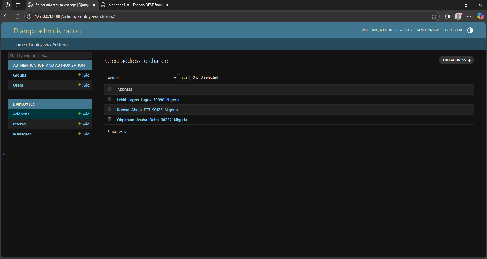
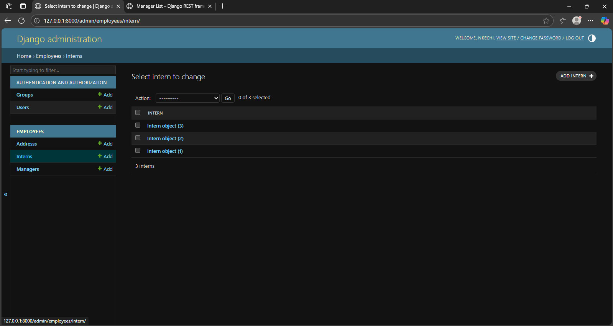
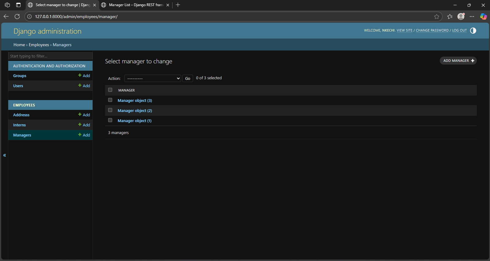

# SEN202EXAM_9839
SEN202 Pratical Exam

# Staff Management System

A Django-based staff management application for tracking employees, managers, and interns.

## 📌 Project Overview

This system provides:
- Staff hierarchy management (Managers and Interns)
- Employee records with contact details
- Department organization
- Internship tracking

## 🛠 Technologies Used

- Python 3
- Django
- PostgreSQL (or SQLite for development)
- Django Admin Interface

## 📂 Project Structure
**I answered Question1, Question2, Question3**

## 👨‍💻 Author Information

**Full Name:** Olisedeme Nkechi Wealth  
**Matric Number:** VUG/SEN/23/9839  
**GitHub:** [@EnkayCodes](https://github.com/EnkayCodes)

## 👨‍💻 SuperUser Information

**Name:** Nkechi 
**Email:** olisedemjasmine@gmail.com  
**Password:** Jasminee


## 🚀 Getting Started

1. Clone the repository:
   '''git clone https://github.com/EnkayCodes/SEN202EXAM_9839.git'''
2. Create Virtual Environment
    ```python -m venv nkechi_sen202_env```
3. Activate virtual environment
    ```nkechi_sen202_env/Scripts/activate.bat```
4. Install requiremts
    ```pip install -r requirements.txt```
5. Create a django project
   ``` django-admin startproject nkechi_staff_api```
6. Enter into the django project
    ```cd nkechi_staff_api```
7. Create django apps
    ```python manage.py startapp employees```
8. Code Implementations

9. Apply migrations and runserver
    - ```python manage.py makemigrations```
    - ```python manage.py migrate```
    - ```python manage.py runserver```





